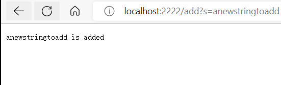
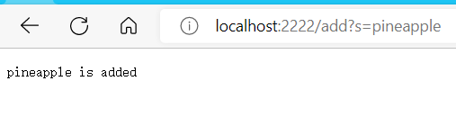
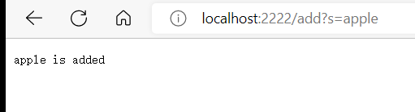
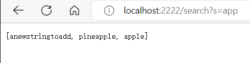

# lab report for week 3 lab<br />
<br />

# Search Engine

## Code
```
import java.io.IOException;
import java.net.URI;
import java.util.ArrayList;

class HandlerSearch implements URLHandler{
    ArrayList<String> addedList = new ArrayList<>();
    public String handleRequest(URI url){
        if (url.getPath().contains("/add")){

            String[] parameters = url.getQuery().split("=");
            if (parameters[0].equals("s")){

                addedList.add(parameters[1]);
                return parameters[1] + " is added";
            }
        }
        else if(url.getPath().contains("/search")) {
            ArrayList<String> Found = new ArrayList<>();
            String[] parameter = url.getQuery().split("=");
            if (parameter[0].equals("s")) {

                for(String OneEle:addedList){
                    OneEle.contains(parameter[1]);
                    Found.add(OneEle);
                }
                return Found.toString();
            }
        }
        return "404 Not Found!";
    }
}

class SearchEngine {
    public static void main(String[] args) throws IOException {
        if(args.length == 0){
            System.out.println("Missing port number! Try any number between 1024 to 49151");
            return;
        }

        int port = Integer.parseInt(args[0]);

        Server.start(port, new HandlerSearch());
    }
}

```

## Add-1


In this line, handleRequest method was called. And it enters this if statement
```
if (url.getPath().contains("/add")){
```
parameters[1] will have a value of anewstringtoadd
and it is added to the ArrayList addedList
## Add-2


In this line, handleRequest method was called. And it enters this if statement
```
if (url.getPath().contains("/add")){
```
parameters[1] will have a value of pineapple
and it is added to the ArrayList addedList
## Add-3


In this line, handleRequest method was called. And it enters this if statement
```
if (url.getPath().contains("/add")){
```
parameters[1] will have a value of apple
and it is added to the ArrayList addedList
## Search


In this line, handleRequest method was called. And it enters this if statement
```
else if(url.getPath().contains("/search")) {
```
parameters[1] will have a value of app
both pineapple and apple will be added to found

# Fixing code