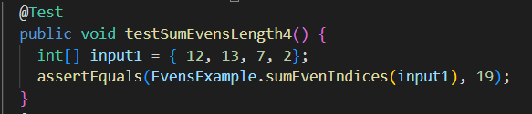
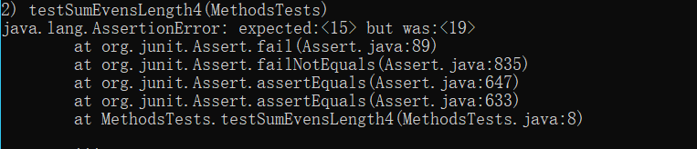
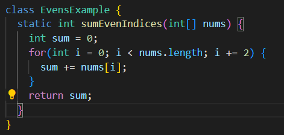
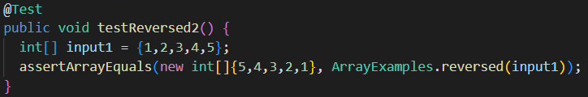
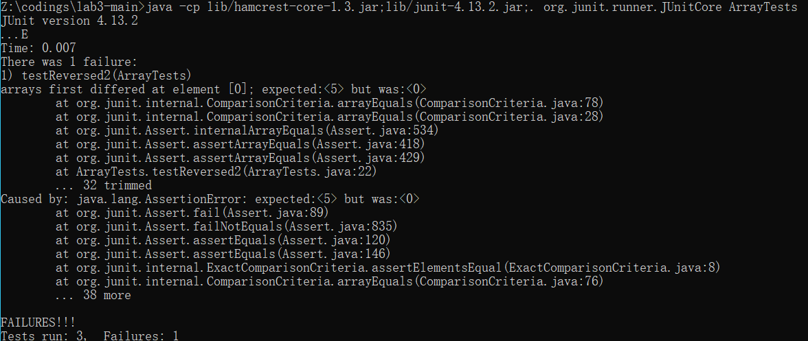
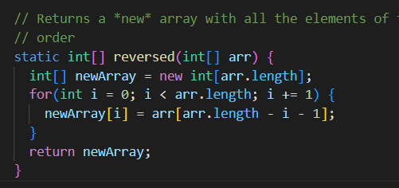

# lab report for week 3 lab<br />
<br />

# Search Engine

## Code
```
import java.io.IOException;
import java.net.URI;
import java.util.ArrayList;

class HandlerSearch implements URLHandler{
    ArrayList<String> addedList = new ArrayList<>();
    public String handleRequest(URI url){
        if (url.getPath().contains("/add")){

            String[] parameters = url.getQuery().split("=");
            if (parameters[0].equals("s")){

                addedList.add(parameters[1]);
                return parameters[1] + " is added";
            }
        }
        else if(url.getPath().contains("/search")) {
            ArrayList<String> Found = new ArrayList<>();
            String[] parameter = url.getQuery().split("=");
            if (parameter[0].equals("s")) {

                for(String OneEle:addedList){
                    OneEle.contains(parameter[1]);
                    Found.add(OneEle);
                }
                return Found.toString();
            }
        }
        return "404 Not Found!";
    }
}

class SearchEngine {
    public static void main(String[] args) throws IOException {
        if(args.length == 0){
            System.out.println("Missing port number! Try any number between 1024 to 49151");
            return;
        }

        int port = Integer.parseInt(args[0]);

        Server.start(port, new HandlerSearch());
    }
}

```

## Add-1


In this line, handleRequest method was called. And it enters this if statement
```
if (url.getPath().contains("/add")){
```
parameters[1] will have a value of anewstringtoadd
and it is added to the ArrayList addedList
## Add-2


In this line, handleRequest method was called. And it enters this if statement
```
if (url.getPath().contains("/add")){
```
parameters[1] will have a value of pineapple
and it is added to the ArrayList addedList
## Add-3


In this line, handleRequest method was called. And it enters this if statement
```
if (url.getPath().contains("/add")){
```
parameters[1] will have a value of apple
and it is added to the ArrayList addedList
## Search


In this line, handleRequest method was called. And it enters this if statement
```
else if(url.getPath().contains("/search")) {
```
parameters[1] will have a value of app
both pineapple and apple will be added to found

# Fixing code

## First fix
Test:



Symptom:


Bug(already fixed):



Here, the original method has 
```
sum += nums[i+1]
```
This will actually give us the sum of odd indices. i here will be 0,2,4... And they are already even idices, +1 will make them odd. A index out of bound exception might also be caused here.


## Second fix

Test:



Symptom:


Bug(already fixed):



The original code copied the elements in the new created array to the old array. So the new array will have its original value of 0. It also returned the arr instead of newArray. After changing the position of newArray and arr in the for loop and changing the return array, the method will function normally.